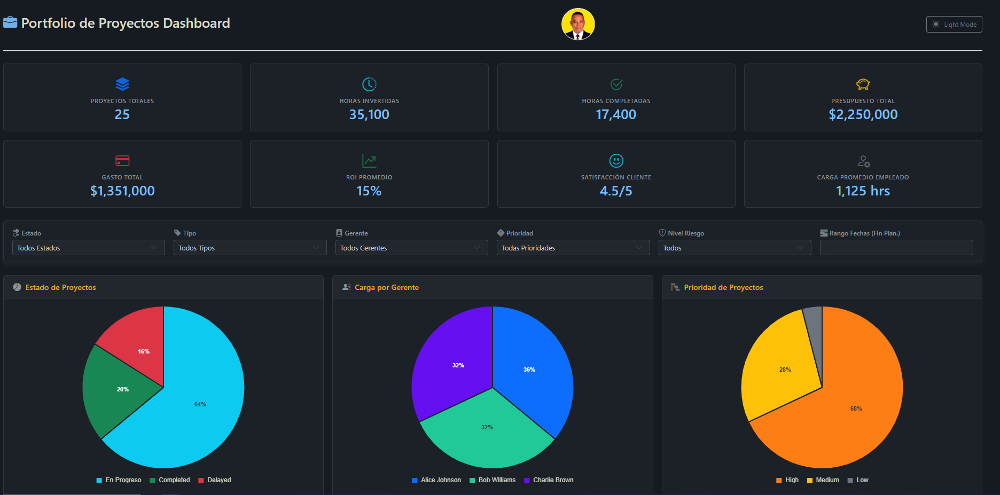
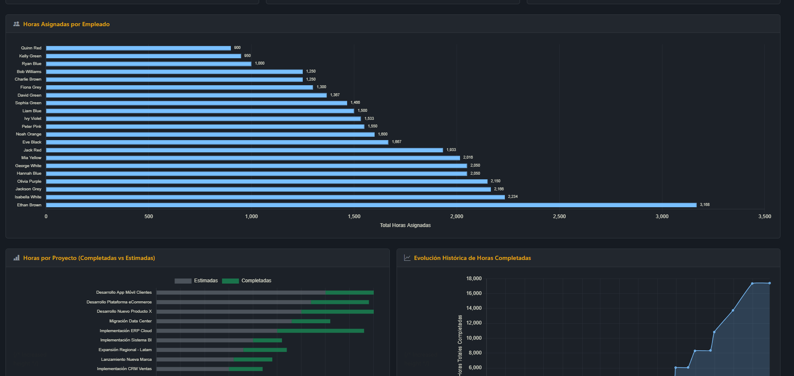
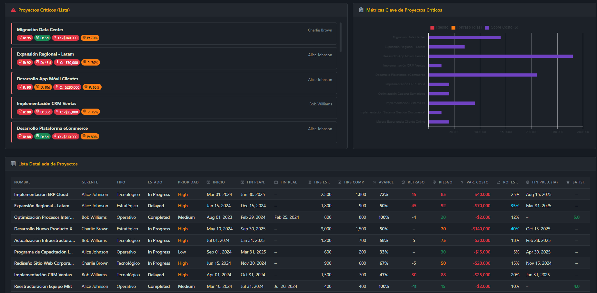

# 📊 Dashboard de Portafolio: Una Solución Moderna para Gestión de Proyectos

¡Bienvenido al **Dashboard de Portafolio**! 🚀 Una aplicación web elegante, interactiva y responsiva diseñada para ofrecer una visión integral y dinámica de la gestión de portafolios de proyectos. Este dashboard visualiza métricas clave, el estado de los proyectos y la asignación de recursos, permitiendo a los gerentes de proyectos, equipos y stakeholders tomar decisiones informadas y basadas en datos.

Si eres un desarrollador que busca un proyecto práctico, un estudiante que desea aprender sobre tecnologías web modernas, o un profesional que necesita una herramienta de visualización personalizable, este proyecto es una invitación abierta a explorar, replicar y mejorar. ¡Sumérgete, adáptalo a tus necesidades y contribuye a hacerlo aún mejor! 💡








## 📁 Estructura del Proyecto

```
📦 PORTAFOLIO-ADMINISTRACION-PROYECTOS/
├── 📄 index.html                 # Archivo principal HTML
├── 🎨 css/
│   └── style.css                 # Estilos y diseño visual
├── ⚡ js/
│   └── script.js                 # Lógica e interactividad
├── 📊 data/
│   └── data.json                 # Datos del portafolio
├── 📸 assets/
│   └── screenshots/              # Capturas de pantalla
│       ├── screenshot_1.png
│       ├── screenshot_2.png
│       └── screenshot_3.png
├── 📖 README.md                  # Documentación del proyecto
└── 📜 LICENSE                    # Licencia MIT
```

## 🌟 ¿Por qué este proyecto?

Este dashboard fue creado para satisfacer la necesidad de una herramienta centralizada y visualmente atractiva para monitorear portafolios de proyectos. Rastrea X proyectos, Y horas invertidas y métricas clave (KPIs) como eficiencia, retrasos y cumplimiento de cronogramas. Con funciones como filtros dinámicos, mapas de calor de riesgos y tendencias históricas, es una solución práctica para desafíos reales de gestión de proyectos.

El proyecto es amigable para principiantes, pero lo suficientemente robusto para uso profesional, lo que lo hace ideal para aprendizaje, prototipado o implementación en entornos de producción. 🛠️

- 📈 **Rastrear múltiples proyectos** simultáneamente
- ⏰ **Visualizar las horas invertidas** por proyecto
- 📊 **Analizar métricas clave de rendimiento (KPIs)**
- 🔍 **Filtros dinámicos** para análisis específicos
- ⚠️ **Análisis de riesgos** y tendencias históricas
- 📱 **Diseño completamente responsivo**

## 🛠️ Tecnologías Utilizadas

### Frontend Core
-  **HTML5** - Estructura semántica del dashboard
-  **CSS3** - Diseño visual, tema oscuro y responsivo  
-  **JavaScript ES6+** - Interactividad y lógica de negocio

### Frameworks & Librerías
-  **Bootstrap 5.3** - Framework CSS responsivo
- 📈 **Chart.js 4.x** - Gráficos interactivos y personalizables
- 📅 **Moment.js** - Manejo y formateo de fechas
- 🗓️ **Litepicker** - Selector de rangos de fechas
- 🎯 **Bootstrap Icons** - Iconografía SVG escalable

### Datos & Almacenamiento
-  **JSON** - Almacenamiento estructurado de datos

## ✨ Características Destacadas

### 🏠 Panel de KPIs (Indicadores Clave de Rendimiento)
- Proyectos totales y estados
- Horas invertidas vs. estimadas
- Presupuesto vs. gastos reales
- Tasas de cumplimiento
- ROI por proyecto

### 📊 Visualizaciones Interactivas
- 🥧 **Gráficos de torta** - Distribución de estados de proyectos
- 📊 **Gráficos de barras** - Análisis de horas y progreso
- 📈 **Gráficos de líneas** - Tendencias temporales
- 🎯 **Indicadores de riesgo** - Semáforo visual de estados

### 🔍 Funcionalidades Avanzadas
- **Filtros Dinámicos**: Por tipo, estado, gerente, prioridad y fechas
- **Tabla Detallada**: Información completa con barras de progreso
- **Tema Oscuro/Claro**: Conmutable con persistencia de preferencias
- **Diseño Responsivo**: Adaptable a móviles, tablets y escritorio
- **Resumen Ejecutivo**: Generación automática de informes

### 👥 Gestión de Recursos
- Carga de trabajo por gerente de proyecto
- Distribución de proyectos por equipo
- Análisis de disponibilidad de recursos

## 🚀 Cómo Comenzar

### 1️⃣ Clona el Repositorio
```bash
git clone https://github.com/JUANCITOPENA/PORTAFOLIO-DE-ADMINISTRACION-DE-PROYECTS.git
cd PORTAFOLIO-DE-ADMINISTRACION-DE-PROYECTS
```

### 2️⃣ Estructura de Archivos
Asegúrate de tener los siguientes archivos:
- `index.html` - Archivo principal
- `css/style.css` - Estilos
- `js/script.js` - JavaScript
- `data/data.json` - Datos del portafolio

### 3️⃣ Ejecuta el Proyecto Localmente

#### 🟢 Opción 1: VS Code + Live Server (Recomendado)
1. Abre la carpeta del proyecto en Visual Studio Code
2. Instala la extensión "Live Server"
3. Clic derecho en `index.html` → "Open with Live Server"

#### 🟡 Opción 2: Python
```bash
# Python 3
python -m http.server 8000

# Python 2
python -m SimpleHTTPServer 8000
```
Luego ve a `http://localhost:8000`

#### 🔵 Opción 3: Node.js
```bash
# Instalar globalmente
npm install -g http-server
http-server

# O usar npx (sin instalación)
npx http-server
```

### 4️⃣ Personaliza el Dashboard
- Modifica `data/data.json` con tus proyectos reales
- Ajusta `css/style.css` para cambiar la apariencia
- Expande `js/script.js` para añadir funcionalidades

## 📊 Estructura de Datos (data.json)

```json
{
  "projects": [
    {
      "id": 1,
      "name": "Proyecto Alpha",
      "status": "En Progreso",
      "priority": "Alta",
      "risk": "Medio",
      "manager": "Juan Pérez",
      "team": "Frontend",
      "startDate": "2024-01-15",
      "endDate": "2024-06-30",
      "progress": 65,
      "budget": 50000,
      "spent": 32500,
      "estimatedHours": 800,
      "completedHours": 520
    }
  ]
}
```

## 🎯 Resultados y Entregables

### ✅ Lo que obtienes:
- **Visualización Centralizada** de todos los proyectos
- **Interfaz Moderna** con tema oscuro/claro
- **Interactividad en Tiempo Real** con filtros dinámicos
- **Adaptabilidad Total** a diferentes dispositivos
- **Escalabilidad** para nuevos proyectos y métricas

## 📚 Beneficios Profesionales y Educativos

### 💼 Para Profesionales
- ✅ Toma de decisiones basada en datos
- ✅ Supervisión eficaz de portafolios
- ✅ Identificación temprana de riesgos
- ✅ Mejora de la eficiencia del equipo
- ✅ Transparencia en la comunicación

### 🎓 Para Estudiantes
- ✅ Aprendizaje práctico de desarrollo web
- ✅ Visualización de datos interactiva
- ✅ Principios de diseño responsivo
- ✅ Desarrollo frontend moderno
- ✅ Manejo de datos JSON
- ✅ Contribución a código abierto

## 🔮 Mejoras Futuras

### 🚀 Próximas Funcionalidades
- 🤖 **Predicciones con IA/ML** - Análisis predictivo avanzado
- 💰 **Métricas Financieras Detalladas** - EVM, ROI granular
- 🔔 **Sistema de Notificaciones** - Alertas automáticas
- 📄 **Exportación de Reportes** - PDF, CSV, Excel
- 👥 **Gestión Avanzada de Recursos** - Planificación de capacidad

### 🔗 Integraciones Posibles
- **Power BI / Tableau** - Análisis empresarial avanzado
- **Jira / Asana / Trello** - Importación automática de datos
- **Slack / Teams** - Notificaciones en tiempo real
- **Google Sheets / Excel** - Sincronización bidireccional

## 🤝 Contribuciones

¡Las contribuciones son bienvenidas! 🙌

### 🐛 ¿Encontraste un Bug?
- Abre un [Issue](https://github.com/JUANCITOPENA/PORTAFOLIO-DE-ADMINISTRACION-DE-PROYECTS/issues)

### 💡 ¿Tienes una Idea?
- Crea un [Feature Request](https://github.com/JUANCITOPENA/PORTAFOLIO-DE-ADMINISTRACION-DE-PROYECTS/issues)

### 💻 ¿Quieres Contribuir Código?
1. Haz un **Fork** del repositorio
2. Crea una rama: `git checkout -b feature/AmazingFeature`
3. Confirma cambios: `git commit -m 'Add AmazingFeature'`
4. Push a la rama: `git push origin feature/AmazingFeature`
5. Abre un **Pull Request**

## 📜 Licencia

Este proyecto está bajo la **Licencia MIT**. Ve el archivo [LICENSE](LICENSE) para más detalles.

```
MIT License

Copyright (c) 2024 JUANCITOPENA

Permission is hereby granted, free of charge, to any person obtaining a copy
of this software and associated documentation files (the "Software"), to deal
in the Software without restriction, including without limitation the rights
to use, copy, modify, merge, publish, distribute, sublicense, and/or sell
copies of the Software, and to permit persons to whom the Software is
furnished to do so, subject to the following conditions:

The above copyright notice and this permission notice shall be included in all
copies or substantial portions of the Software.
```

## 🙏 Agradecimientos

Un sincero agradecimiento a las comunidades de código abierto:
-  **Bootstrap Team**
- 📈 **Chart.js Contributors**
- 📅 **Moment.js Community**
- 🗓️ **Litepicker Developers**
- 🎯 **Bootstrap Icons Team**

## 🔗 Conecta con el Autor

<div align="center">

[](https://github.com/JUANCITOPENA)
[](https://linkedin.com/in/juancitopeña)

</div>

---

<div align="center">

### ⭐ Si este proyecto te fue útil, ¡dale una estrella! ⭐

**¡Construyamos juntos herramientas increíbles!** 🚀✨

Made with ❤️ by [JUANCITOPENA](https://github.com/JUANCITOPENA)

</div>
